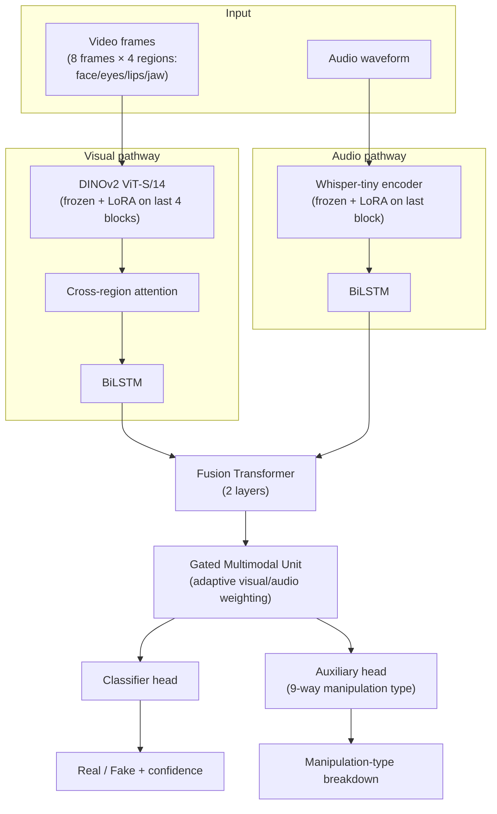

# MultiModal Temporal Deepfake Detection

<p align="center">
  
  
  
  
</p>

<p align="center">
A multimodal, temporal deepfake detector combining frozen self-supervised visual (<b>DINOv2</b>) and audio (<b>Whisper</b>) backbones, fine-tuned with <b>LoRA</b>, fused via cross-region attention + BiLSTM + a Transformer + a <b>Gated Multimodal Unit</b> — built as much to honestly measure <i>where a strong detector stops generalizing</i> as to detect fakes in-distribution.
</p>

<p align="center">
  <a href="#quickstart">Quickstart</a> ·
  <a href="#results">Results</a> ·
  <a href="#architecture">Architecture</a> ·
  <a href="#key-findings">Key Findings</a> ·
  <a href="#running-the-full-pipeline">Full Pipeline</a> ·
  <a href="#api-reference">API</a>
</p>

---

## Table of Contents

- [Overview](#overview)
- [Quickstart](#quickstart)
- [Results](#results)
- [Architecture](#architecture)
- [Key Findings](#key-findings)
  - [Identity-leakage bug in dataset splitting](#1-identity-leakage-bug-in-dataset-splitting)
  - [Cross-dataset generalization gap](#2-cross-dataset-generalization-gap)
  - [Boundary-cue causal ablation](#3-boundary-cue-causal-ablation)
  - [Multi-seed variance study](#4-multi-seed-variance-study)
- [Datasets](#datasets)
- [Running the Full Pipeline](#running-the-full-pipeline)
- [API Reference](#api-reference)
- [Repository Structure](#repository-structure)
- [Reproducibility](#reproducibility)
- [Citation](#citation)
- [License](#license)

---

## Overview

Most deepfake detectors report near-perfect accuracy on held-out splits of their own training distribution and stop there. This project treats that as the *start* of the evaluation, not the end: a fully held-out external dataset (DFDC) is reserved from day one and never touched by training, validation, threshold selection, or even model-selection — and the gap between in-distribution and cross-dataset performance is reported as the paper's central finding, not hidden behind a headline number.

**In one sentence**: AUC 0.998 in-distribution, AUC ~0.71 on a genuinely unseen dataset — and this repo documents, quantitatively, *why*.

<details>
<summary><b>Why this matters</b> (click to expand)</summary>

<br>

A detector that reports 99% accuracy on its own benchmark but silently degrades on a forgery technique it hasn't seen cannot be considered solved for deployment. This project:
- Never lets the cross-dataset test set (DFDC) influence training, hyperparameters, thresholds, **or configuration selection** (a subtle leak this project found and fixed in itself — see [Key Findings](#key-findings)).
- Ran a **connected-components identity-safe split algorithm** after discovering the original splitting logic leaked up to 91% of identities across train/val/test.
- Replaced a **qualitative** Grad-CAM interpretation with a **quantitative causal ablation** that overturned it.
- Ran a **multi-seed variance study** to distinguish genuine effects from training noise — rare in this literature.

</details>

---

## Quickstart

```bash
git clone https://github.com/Abhijith-Reddy-ch/MultiModal-Temporal-Deepfake-Detection.git
cd MultiModal-Temporal-Deepfake-Detection
pip install -r requirements.txt
```

<details>
<summary><b>Run the web demo</b> (FastAPI backend + Next.js frontend)</summary>

<br>

```bash
# Terminal 1 - backend (loads the canonical checkpoint, serves on :8000)
python -m backend.app

# Terminal 2 - frontend (serves on :3000)
cd ui/frontend
npm install
npm run dev
```

Open **http://localhost:3000**, upload a video, get a real-time verdict with:
- Fake probability + confidence
- Per-modality (visual/audio) contribution via the GMU gate
- Per-frame probability trace
- Manipulation-type breakdown (9-way auxiliary head)
- Grad-CAM visual explanation

</details>

<details>
<summary><b>Or hit the API directly</b></summary>

<br>

```bash
curl -X POST http://127.0.0.1:8000/predict -F "file=@your_video.mp4"
```

```json
{
  "type": "video",
  "prediction": "Real",
  "confidence": 0.993,
  "fake_probability": 0.0066,
  "modality_scores": {"visual": 0.457, "audio": 0.543},
  "manipulation_type_breakdown": {"real": 0.998, "faceswap": 0.00001, "...": "..."}
}
```

</details>

---

## Results

| Metric | Value |
|---|---|
| In-distribution AUC (FakeAVCeleb + PolyGlotFake + FaceForensics++ + Celeb-DF-v2) | **0.998** |
| In-distribution accuracy | **>99%** |
| **DFDC (fully held-out) AUC** | **0.716 ± 0.012** (3-seed mean ± std) |
| DFDC accuracy at calibrated threshold | 42–52% (varies by seed — see [finding #4](#4-multi-seed-variance-study)) |
| DFDC real-video accuracy | ~90% |
| DFDC fake-video recall | 23–52% (the generalization gap, quantified) |

The in-distribution number is not the interesting one. The **0.28+ AUC drop on DFDC, held constant across six independent mitigation attempts** (regularization, augmentation, synthetic data, an added frequency-domain modality) is the paper's actual contribution — see [`DFDC_GENERALIZATION_INVESTIGATION.md`](DFDC_GENERALIZATION_INVESTIGATION.md) for the full investigation log.

---

## Architecture



<details>
<summary><b>Component details</b></summary>

<br>

| Component | Role |
|---|---|
| **DINOv2 ViT-S/14** | Frozen self-supervised visual backbone; LoRA-adapted on the last 4 transformer blocks in Stage B |
| **Whisper-tiny encoder** | Frozen self-supervised audio backbone; LoRA-adapted on the last encoder block |
| **Cross-region attention** | Attends across 4 facial regions (face/eyes/lips/jaw) per frame |
| **BiLSTM ×2** | Temporal modeling per modality across 8 sampled frames |
| **Fusion Transformer** | 2-layer transformer fusing visual + audio temporal sequences |
| **Gated Multimodal Unit (GMU)** | Learns to adaptively weight visual vs. audio contribution per sample |
| **Auxiliary head** | 9-way manipulation-type classification (faceswap, wav2lip, RTVC, ...), trained jointly with 0.4× loss weight |

Two-stage training: **Stage A** trains the fusion head on cached, frozen backbone features (fast). **Stage B** unfreezes the backbones via LoRA and fine-tunes end-to-end on raw crops/audio (slow, ~2-4hrs on an 8GB GPU).

</details>

---

## Key Findings

This project's most valuable output isn't the architecture — it's the methodology audit performed on it. Four findings, each with a quantitative before/after:

### 1. Identity-leakage bug in dataset splitting

The original train/val/test splitting algorithm assigned each identity *token* independently to a split, then routed a video to whichever split any of its identities belonged to. This silently fails whenever a video references **two** identities (e.g. a face-swap video naming both the source-face donor and the target-video identity) — a video pairing a train-assigned identity with a test-assigned one leaks the train identity into the test set.

<details>
<summary><b>Quantified impact</b></summary>

<br>

| Source | Identities checked | Leaked across splits |
|---|---|---|
| FakeAVCeleb | 500 | **455 (91.0%)** |
| FaceForensics++ (genuine) | 1,000 | 488 (48.8%) |
| Celeb-DF-v2 | 59 | **59 (100%)** |

**Fixed** via a connected-components algorithm (union every pair of identities that co-occur in a video, split at the component level) + balanced greedy bin-packing (component sizes were extremely skewed — the 10 largest of 15,280 components covered 54.8% of all videos). Result: **zero leakage** across all 16,326 identities post-fix, split within 0.1% of the target 80/10/10 by video count.

A separate audit also found the "FaceForensics++" data bucket was **72% mislabeled Celeb-DF-v2** — corrected via filename-convention classification (`pipeline/phase1_organize.py::classify_ffpp_source`).

</details>

### 2. Cross-dataset generalization gap

Six independent attempts to close the DFDC generalization gap — LoRA fine-tuning, data augmentation, weight decay, [Self-Blended Images](https://arxiv.org/abs/2204.08376) synthetic data, and an SRM frequency-domain branch — all converged on the same **0.65–0.71 AUC band**, with no clear upward trend. The bottleneck is diagnosed as limited generation-method diversity in the training data (3–4 closely related families), not model capacity or training recipe.

### 3. Boundary-cue causal ablation

A Grad-CAM spot-check on confidently-wrong DFDC fakes suggested the model over-relies on spatial blending-boundary sharpness. A follow-up **causal test** — masking/blurring the boundary region vs. the interior vs. an area-matched random control, across all 400 DFDC held-out videos — **contradicted this**: boundary masking changed AUC no more than a random-region control did, while masking the *interior* (skin texture) region dropped AUC by 0.092, by far the largest effect.

> Attention maps show where a model *looked*, not what it *depends on*. A qualitative interpretation was falsified by a quantitative test, and the paper reports both.

### 4. Multi-seed variance study

Three independent seeds of the canonical configuration:

| Seed | In-dist AUC | DFDC AUC | DFDC Accuracy |
|---|---|---|---|
| 1 | 0.9984 | 0.7091 | 42.25% |
| 2 | 0.9988 | 0.7295 | 44.75% |
| 3 | 0.9972 | 0.7083 | 52.00% |
| **Mean ± std** | **0.9981 ± 0.0008** | **0.7156 ± 0.0120** | 46.33% ± 5.06pp |

AUC is stable across seeds. **Accuracy at the selected operating threshold is not** (42–52%) — because the balanced-accuracy threshold-selection step itself proved seed-sensitive even when the underlying AUC barely moved. A stable AUC across retrains does not imply a stable deployed operating point.

---

## Datasets

| Source | Real | Fake | Total | Role |
|---|---|---|---|---|
| FakeAVCeleb | 500 | 21,066 | 21,566 | Train/val/test |
| PolyGlotFake | 762 | 13,605 | 14,367 | Train/val/test |
| FaceForensics++ | 1,000 | 1,000 | 2,000 | Train/val/test |
| Celeb-DF-v2 | 590 | 5,639 | 6,229 | Train/val/test |
| **DFDC** | 77 | 323 | 400 | **Held out — never touched by training/tuning/selection** |

Split **80/10/10 by identity** (connected-components-safe, see [finding #1](#1-identity-leakage-bug-in-dataset-splitting)), not by video.

---

## Running the Full Pipeline

<details>
<summary><b>1. Data organization → splitting</b></summary>

<br>

```bash
python pipeline/phase1_organize.py    # Build unified inventory from raw datasets
python pipeline/phase2_clean.py       # Drop corrupt/unreadable videos
python pipeline/phase4_split.py       # Identity-safe 80/10/10 split
python pipeline/phase5_extract.py     # Face/region crop + audio extraction
```

</details>

<details>
<summary><b>2. Feature caching + Stage A training</b></summary>

<br>

```bash
python training/extract_features.py   # Cache frozen DINOv2/Whisper features
python training/train.py              # Stage A: train fusion head on cached features
```

</details>

<details>
<summary><b>3. Stage B: LoRA fine-tuning</b></summary>

<br>

```bash
# Canonical recipe (no augmentation, no weight decay)
USE_AUGMENTATION=0 WEIGHT_DECAY=0 python training/train_stage_b.py

# Optional: fixed seed for reproducibility
SEED=42 USE_AUGMENTATION=0 WEIGHT_DECAY=0 python training/train_stage_b.py
```

</details>

<details>
<summary><b>4. Evaluation</b></summary>

<br>

```bash
python training/evaluate_stage_b.py           # Full in-dist + DFDC evaluation
python scripts/dfdc_error_analysis.py         # Technical-covariate breakdown of errors
python scripts/gradcam_spotcheck_dfdc.py      # Grad-CAM on confidently-wrong DFDC fakes
python scripts/dfdc_boundary_ablation.py      # Quantitative boundary-cue causal test
```

</details>

---

## API Reference

| Endpoint | Method | Description |
|---|---|---|
| `/health` | GET | `{"status": "ok", "model_loaded": true}` |
| `/predict` | POST | Upload a video, get verdict + modality/frame/manipulation-type breakdown |
| `/gradcam` | POST | Upload a video, get Grad-CAM visual explanation frames |

---

## Repository Structure

```
├── pipeline/          # Data organization, cleaning, identity-safe splitting, extraction
├── training/          # Model, datasets, Stage A/B training, evaluation, explainability
├── backend/           # FastAPI inference server
├── ui/frontend/        # Next.js demo UI
├── scripts/           # Diagnostics: error analysis, Grad-CAM spot-checks, ablations
├── paper/             # IEEE-format paper (deepfake_detection_ieee.tex)
└── DFDC_GENERALIZATION_INVESTIGATION.md   # Full investigation log, all four findings in detail
```

---

## Reproducibility

Random seed 42 is used for deterministic data-level operations (frame sampling, split assignment). Model weight initialization and training-loop stochasticity are **not** globally seeded by default — set `SEED=<n>` when invoking `train_stage_b.py` to fix this explicitly (see [finding #4](#4-multi-seed-variance-study) for why this matters).

## Citation

```bibtex
@misc{multimodal-temporal-deepfake-detection,
  title  = {MultiModal Temporal Deepfake Detection: Cross-Dataset Generalization Limits of a Multimodal Detector},
  author = {Chalamalla, Abhijith Reddy},
  year   = {2026},
  url    = {https://github.com/Abhijith-Reddy-ch/MultiModal-Temporal-Deepfake-Detection}
}
```

## License

MIT — see [LICENSE](LICENSE).
